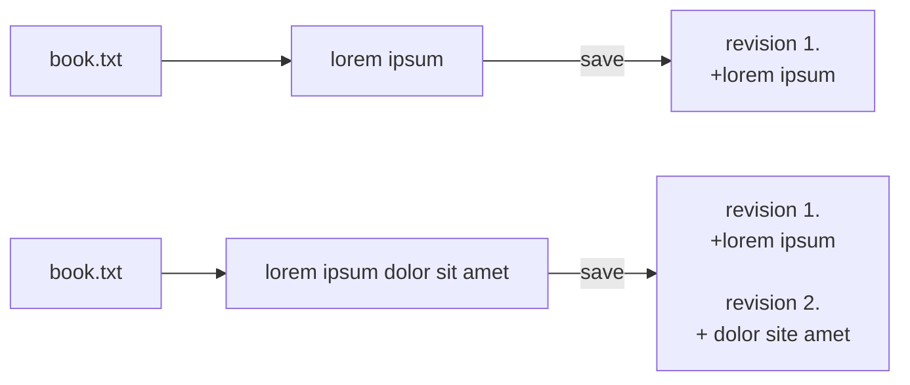

# Node.js Fullstack Engineer Challenge

## 1. About you

> Tell us about one of your commercial projects with Node.js and/or AngularJS.

I would like to talk about my first project I had to do with AngularJS and Node.js. It was a web application dedicated to ophthalmology. Initialy developed with Symfony and TWIG there was a lot of performance issue. So I recommended to switch from this stack to an AngularJS / Node.js application. At first I've chosen to migrate the API written in PHP to Node.js. All the APIs were testable using mocha/chai and documented with swagger. Then I started to re-write the front with AngularJS 1.5 at the time. This was the first project I had to do with this stack and since, I love to rewrite or design these type of application.

## 2. Document versioning

> Detail how you would store several versioned, text-based documents, and present a schema for your solution.

>

> It should be able to show:

>  - the document in its current state

>  - the document at any point in its history

>  - the changes made between two versions

>

> Strive for disk space efficiency.

My first thought was to handle version of a file like GIT does. But if I have to handle disk space effectively, I'd head to a mechanism more like SVN. I will try to explain myself with an example.

 We create a file book.txt with "lorem ipsum" in it and save it to the filesystem. When we are saving, we say to a repository that this book.txt must be tracked by the versioning system (let's call it BookVersionControl BVC). Each time I save the book, I say to BVC that the current version is the latest version (head) and the BVC store, in another directory/heap/trunk, the difference that has been written (maybe with a hash that contains a timestamp and a revision number).

Then if I continue to write into the document then save, the BVC will update and save the current version and add to the heap the difference that has been added.

If I want to go from v3 to v1 I have to apply the difference from v3 to v2 then v2 to v1. It's less effective than

## 3. Node.js REST API

`cd q3` && `npm install` && `npm start`.